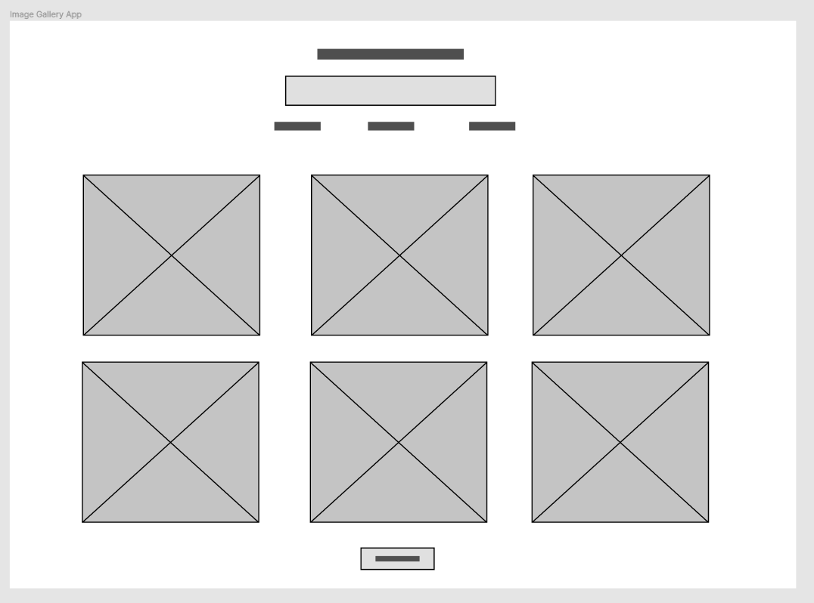
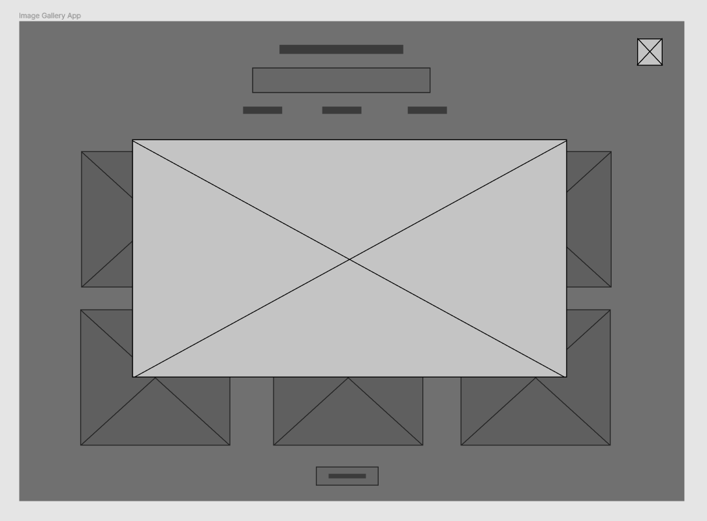

# Photo Gallery Application

My second app is going to be the location and weather app.
To open the app run the follwing commands in the `gallery-app/` directory.

1. `npm i` to install the dependencies.
2. `npm run build` to build the React App.
3. `npm run electron` to run the React App in an electron desktop window.

## API Keys

The keys are hard-coded, if they don't work use the ones below.

### Imgur

**Client ID:** `5b439a3ef4793a3`  
Will be added into `gallery-app/src/App.jsx` line `5`.

### Pixabay 

**API Key:** `13861070-a1e2d0e3eb62e8aa3037589d4`    
Will be added into `gallery-app/src/App.jsx` line `6`.

### Unsplash

**App ID:** `c4f5fabfff24f47c014261d3f5b025ad3ef602dad297e8046815e571123ac699`  
Will be added into `gallery-app/src/App.jsx` line `8`.

**Secret:** `fd3e4fb5879caaec1c864818c41fa8506cf4d3acde62daef73fc68bb6be45d93`  
Will be added into `gallery-app/src/App.jsx` line `9`.

## Choice of framework

The framework I decided to go with for this image gallery application is Electron. I chose this Microsoft owned framework due to it being web-based, and being able to work with front-end web technologies such as ReactJS, which is also what I am using in this application.

Electron was easy for me to use as I have much more experience with web farmeworks and JavaScript. This makes the development much easier to create and maintain the application over time. https://dzone.com/articles/what-is-electron-amp-why-should-we-use-it.

For an image gallary, the list of images being updated can be easily achieved using ReactJS, as a list can be outputted into JSX with a `map()` function. This means that I only have to udate the `state` of the image list, by changing the API or the search query, and the page will automatically create the gallery for an unlimited amount of images.

Pulling in JSON style APIs are easy to use in JavaScript frameworks, as the objects can be fetched asyncronously and used directly (without models) which will be helpful with collecting all the image data being pulled in constantly while the user types to search.

JavaScript is one of the easiest languages to use, and has major support in place, as it is the most widely used language in progamming at the moment. ReactJS is a framework on top of Javascript which makes it even easer to use events and DOM updating on single page applications, which would work great for the design of this image gallery applicaition. https://brainhub.eu/blog/electron-desktop-app/.

There are some issues with electron where it uses a lot more memory and the performance isn't as fast as a native applications. Yet, this will not be a major issue with the weather application as it is a small application with only one input, and a list of images; which doesn't require much computer resources. https://medium.com/commitlog/electron-is-cancer-b066108e6c32.

Using web-based styling also allows for easy styling with CSS grids. This give a much greater range of styling attributes to use, and a similer and familiar language. This makes the site look and feel much nicer for the end user, and can be easily made responsive, with resizing of the application.

## Wireframes

